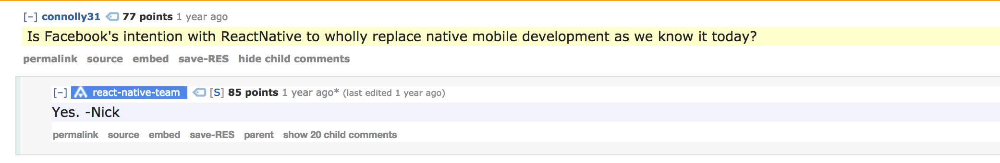

# REACT NATIVE <!-- .element: style="color:white" -->
<!-- .slide: data-background-image="/img/bg.gif" style="color:white"-->
Or how to make mobile development bearable again


> "a framework that will wholly replace mobile development as we know it today."



Note: how?


> "A javascript framework for cross-platform mobile development"
Note: windows mobile is dead, so I can use the word "cross-platform"


## Best features
1. Multiplatform, 80-90% code share!
1. Faster iteration and development speed than native
1. Can be dropped in existant native apps
1. Write once, run anywhere, in JavaScript!


<!-- .element height="25%" width="25%" -->


## Evaluation criteria
1. How is your application flow written/represented? <!-- .element: class="fragment" -->
1. How is your code ran, and by what? <!-- .element: class="fragment" -->
1. Who renders the user interface, and how? <!-- .element: class="fragment" -->


## Phonegap (Cordova)

1. You write code in javascript, and you communicate with native modules through a bridge<!-- .element: class="fragment" -->
1. Your JS code is interpreted by the device's JS Virtual Machine<!-- .element: class="fragment" -->
1. Your views are written in HTML and rendered by the device's webview<!-- .element: class="fragment" -->

Note: sure, you can bundle your own webview, like the crosswalk project, ionic is this, but with Angular since it better leverages hardware acceleration


# But how about React Native?


# React Native

1. You write code in javascript, communicating with native modules through a bridge <!-- .element: class="fragment" -->
1. Your JS code is interpreted by a vendored JavascriptCore <!-- .element: class="fragment" -->
1. Your views are written in React and rendered natively <!-- .element: class="fragment" -->


# React?


> A Javascript library for building user interfaces


> React is a library to declaratively to describe and structure UI.


```
<div class="content">
  <div class="profile">
    
    <span class="info">
      <i class="name">John Doe</i>
      <i class="title">CFO</i>
    </span>
  </div>
  <span class="contentTitle">
    Titles!
  </span>
  ...
</div>
```
Note: this needs containment


```
<Content title="Titles!">
  <Profile photoId="1337" name="John Doe" title="CFO"/>
  ...
</Content>
```
Tons more readable!
Note: INSTEAD OF MEANINGLESS DIVS, COMPONENTS WITH MEANING


```
<ScrollableList>
  {
    profiles.map( profile => (
      <Profile ...profile>
    ))
  }
</ScrollableList>
```


> How the UI changes is up to you.
Note: React is only concerned with the view, unopinionated about anything else


### React isn't just about extracting elements into modules!

* Reusability <!-- .element: class="fragment" -->
* Modulability <!-- .element: class="fragment" -->
* Scope <!-- .element: class="fragment" -->
Note: SIMPLICITY


## React Component
> Just a function (or a class) that given a state, renders that state


## React Component
Large open-source scene, thousands of reusable components
  <div class="fragment fade-in">
      * https://js.coach
      * https://github.com/jondot/awesome-react-native#components
      * https://github.com/react-native-training/react-native-elements
  </div>


But enough of that, what about the native?


## What is react native?

Implementation-wise, RN is a custom screen that reads a js file to know what, when and where to draw.

This is a massive oversimplification please don't hurt me <!-- .element: style="font-size: 15px; " -->
Note: RENDERS A SINGLE COMPONENT WHERE YOUR APP LIVES


## But what about using the OS APIs?

Native modules!

React Native has some by default, but you can roll out your own, just implement an interface!


## Best features

1. Multiplatform, 80-90% code share!
1. Faster iteration and development speed than native
1. Can be dropped in existant native apps
1. JavaScript
Note: let's go over these again, shall we?


## Best features

1. Multiplatform, 80-90% code share!

<div style="position: relative; margin-top: 20px">
  <div style="position: absolute" class="fragment fade-out">You just have to roll out code for platform-specific UI details.</div>
  <div class="fragment fade-in">Metro-bundler is even configured to load .ios.js and .android.js files!</div>
</div>


## Best features

1. Faster iteration and development speed than native

<div style="position: relative; margin-top: 20px">
  <div style="position: absolute" class="fragment fade-out">Metro-bundler allows for hot reload, debug via chrome devtools.</div>
  <div class="fragment fade-in">Since your app is just a js bundle, you can beam that to your clients bypassing the stores!</div>
</div>
Note: and reactotron, others. Developer happiness is a core goal of the project. Hot reload also preserves state!


## Best features

1. Can be dropped in existant native apps

<div style="position: relative; margin-top: 20px">
  <div style="position: absolute" class="fragment fade-out">Since RN exists as a drop-in Activity or ViewController.</div>
  <div class="fragment fade-in">You can integrate your existant native modules with the bridge.</div>
</div>


## Best features

1. JavaScript

<div style="position: relative; margin-top: 20px">
  <div style="position: absolute" class="fragment fade-out">Leverage one of the world's most popular languages and run the same code on multiple platforms.</div>
  <div class="fragment fade-in">From flow to webpack, npm to Typescript, extensive tooling to make JS better exists.</div>
</div>
Note: A more functional approach to JS should also yield good results.


However, a rose without thorns doesn't exist.


## Worst features

1. Javascript

<div style="position: relative; margin-top: 20px; display: flex; justify-content: center;">
  <code style="position: absolute" class="fragment fade-out hljs xquery">

  {} + [] != [] + {}

  </code>
  <div class="fragment fade-in">Tool complexity can create problems in and out of itself.</div>
</div>
Note: Sure, there's ES6, but most of javascript doesn't make sense.  There's a big reliance on tooling in order to overcome lang holes: linters, flow, TS, so There's a bug on your program. Is it your code, the packer, the packer plugins, the minification, the loaders?


## Worst features

1. Driven by Facebook needs

<div style="position: relative; margin-top: 20px; display: flex; justify-content: center;">
  <div style="position: absolute" class="fragment fade-out">Facebook doesn't need a router, apparently.</div>
  <div class="fragment fade-in">
    Sometimes other companies and communities rise to the challenge. No router?
      * https://github.com/airbnb/native-navigation
      * https://github.com/wix/react-native-navigation
      * https://github.com/react-community/react-navigation
  </div>
</div>
Note: Android support was a 2nd concern, things get abandoned sometimes. The community steps in for some of the gaps.


## Worst features

1. Upgrading and native package management is complicated

'react-native link' doesn't always work
Note: RN tries to abstract away native package addons but sometimes it fails, specially since package devs can't keep up with releases.


## Worst features

1. Slight performance overhead

Crossing the bridge takes time.
Note: There's a lot of proxying and adapting in react, which leads to overhead, and while you can code to minimize bridge crossing, you still gotta cross that bridge.


## Worst features

1. Long dependency chain

That's a lot to break compared to native toolkits.


# Live coding!


## Continued future?

* Dogfooded and integrated into products at founding company
* Most code is open sourced, even if Facebook abandons
* Thousands of apps by different companies depend on them
* Microsoft maintains a Modern UI-frontend!

Note: There's been some talk about Facebook leaving RN as big companies often do.


# Testing

Jest!
Note: Testing using Jest, snapshots, CI solutions


## Should you use React?

It depends, but take the plunge!

> $ npm install -g create-react-native-app
> $ create-react-native-app my-app
Note: WEBDEVS -> REACT -> REACT-NATIVE


# THANKS!
